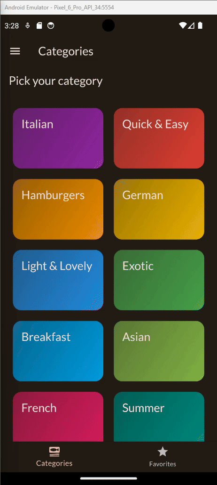

# Meals

A project developed during the Flutter course where the exercise was to pass data from one screen to another and also using providers to store data, such as favorite food

## Getting Started

To run this app locally and explore its codebase, follow these steps:

1. Clone the repository:
   ```bash
   https://github.com/lauro-silva44/meals.git
   ```
2. Install dependencies:
   ```bash
   flutter pub get
   ```
3. Run the app:
   ```bash
   flutter run
   ```
   <div align ="center" >
   
   </div>
